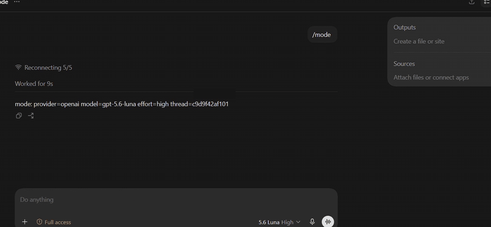

# codex-hop

[](https://github.com/dmitry-dmt/codex-hop/actions/workflows/ci.yml)
[](LICENSE)
[](#limitations)



DeepSeek creates and runs a file with `/dsk`; OpenAI updates the same file with
`/gpt`. The provider changes, while the thread and working context stay intact.

**Unofficial. Not affiliated with, endorsed by, or supported by OpenAI.**

Switch a Codex thread between OpenAI and DeepSeek without leaving it. Type `/dsk` and
the rest of that thread is answered by DeepSeek — same conversation, same files, same
tools. `/gpt` switches back. Useful when your 5-hour usage limit hits 0% mid-task.

OpenCodex and codex-router are more mature and support more providers; `codex-hop`
focuses on switching providers inside the same live Codex thread.

```
you   ▸ /dsk finish the migration script
        ↳ answered by DeepSeek, same thread, same files, same tools
you   ▸ /gpt now review what you just wrote
        ↳ back on OpenAI, history intact
```

`codex-hop` is a small local proxy between your Codex client and its backend. It
relays everything untouched and only steps in when a message starts with a marker.

---

## Before you install: where your data goes

On a `/dsk` turn the router sends your **entire thread** to DeepSeek — message
history, system instructions, tool declarations and tool results. Not a summary. The
full context, re-sent on every turn.

Nothing is stored beyond a per-thread provider choice. No prompts, no responses and
no tool results are written to disk or to logs unless you set
`CODEX_HOP_DEBUG_CONTENT=1`, which the router warns about at startup. See
[SECURITY.md](SECURITY.md).

If sending your thread to a second provider is not acceptable for your work, this
tool is not for that work.

---

## If something goes wrong

The router sits on the path of every Codex request. If it stops, Codex stops with it.
The escape hatch is one line — remove this from your Codex config and restart Codex:

```toml
openai_base_url = "http://127.0.0.1:8788"
```

---

## Install

Requires **Node 22.15+**.

```bash
git clone https://github.com/dmitry-dmt/codex-hop
cd codex-hop
npm install
```

Point Codex at the router by adding one line to `~/.codex/config.toml`
(Windows: `%USERPROFILE%\.codex\config.toml`):

```toml
openai_base_url = "http://127.0.0.1:8788"
```

On Windows a script can do that for you. It takes a timestamped backup, shows the
change before making it, and refuses to guess if the file is ambiguous:

```powershell
powershell -ExecutionPolicy Bypass -File scripts\setup.ps1
```

Then set your key, start the router, and **fully restart Codex**:

```powershell
$env:DEEPSEEK_API_KEY = "sk-..."
npm start
```

Nothing is installed and nothing runs in the background: `npm start` runs in the window
you started it in, and closing that window stops it. To undo the config change:
`powershell -ExecutionPolicy Bypass -File scripts\uninstall.ps1`, which restores your
previous setting only if it still points at a local router.

### Keeping it running

A router that dies with its terminal takes Codex with it — the client cannot reach a
backend that is not there. If you would rather not think about it:

```powershell
powershell -ExecutionPolicy Bypass -File scripts\autostart.ps1
Start-ScheduledTask -TaskName codex-hop
```

That registers a logon task, under your own account and without administrator rights,
which starts the router and restarts it if it exits. Take it back out with
`scripts\autostart.ps1 -Remove`. Set the key with `setx DEEPSEEK_API_KEY "sk-..."`
rather than `$env:` — a logon task cannot see a variable exported in one shell session.

Type `/mode` in any thread to see what is ready:

```
mode: provider=openai model=gpt-5.6-sol effort=high thread=fcd899120e69
      deepseek-key=set mcp-tools=27
```

---

## Commands

Type these at the start of a message in any Codex thread.

| Command | Effect |
| --- | --- |
| `/dsk <task>` | Switch this thread to DeepSeek and do the task |
| `/dsk high` / `/dsk max` | Switch and set reasoning effort |
| `/dsk force <task>` | Proceed even if the thread is over the size guard |
| `/gpt <task>` | Switch back to OpenAI |
| `/mode` | Provider, model, and whether the key and MCP are ready — answered locally |
| `/send-ok` | Confirm a pending write-capable MCP call |

`/dsk low` is not an effort level — `low` is read as the task text.

---

## Tools

Your tools keep working on the other provider, including shell. Commands run in the
client's own sandbox under the client's own approval flow — **the router never
executes shell itself.**

---

## When the limit hits

An exhausted OpenAI limit is reported in the chat with its reset time, instead of
arriving as a broken stream:

> OpenAI usage limit reached, it resets in about 96 min. Type `/dsk` to keep working
> in this thread on DeepSeek.

---

## Long threads

Codex re-sends the whole thread on every turn. Past a few megabytes DeepSeek gets
slow and noticeably worse, so the router refuses rather than let you wait for a bad
answer:

> History in this thread is about 6.2 MB. DeepSeek will be slow and noticeably worse.
> Compact the thread or start a new one. To proceed anyway, type `/dsk force`.

Nothing is truncated and no context is silently dropped. Switch to `/dsk` at the
start of a task rather than at the end of a long thread.

---

## MCP (optional, off by default)

If you have MCP servers configured for Codex, the router can run them on behalf of
the external model.

Read-only by default. A tool is published only if it is in your allow-list **and**
the server reports `annotations.readOnlyHint === true`. Write-capable tools are a
separate opt-in, guarded by a preview plus `/send-ok` confirmation.

Copy [`examples/config.example.json`](examples/config.example.json) into the data
directory as `config.json` to enable it.

---

## What it does not do

- **Execute shell itself.** Commands run in the client's sandbox, under its approvals.
- **Carry reasoning across providers.** Messages, tool calls and tool results cross;
  reasoning does not.
- **Save tokens.** It saves money and quota. The context is the same size.
- **Guarantee it keeps working.** It depends on internal client behaviour, and a
  client update can break it.

## Limitations

- Compaction runs on OpenAI. If your OpenAI limit is exhausted *and* the thread is
  large enough to need compacting, that thread waits for the reset.
- Tested on Windows, against Codex Desktop client 0.149.0. The router has no
  platform-specific code and its data directory already falls back to
  `~/.local/share/codex-hop`, so it may well run elsewhere — but macOS and Linux are
  untested, and `setup.ps1` is PowerShell, so point Codex at the router by hand there.

---

## License

MIT. See [LICENSE](LICENSE).

Contributions are welcome. See [CONTRIBUTING.md](CONTRIBUTING.md).
